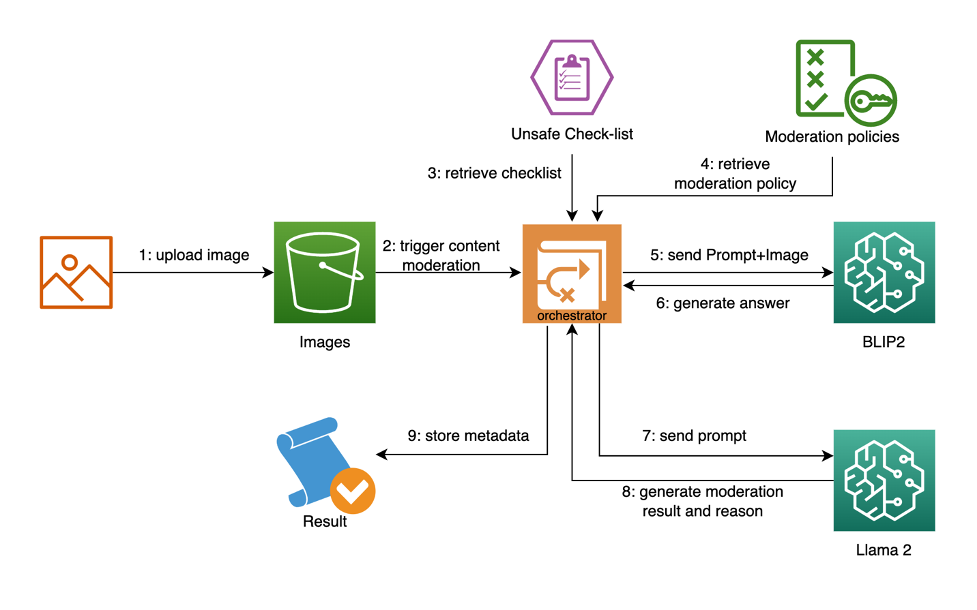
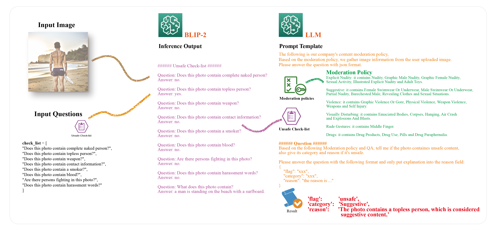
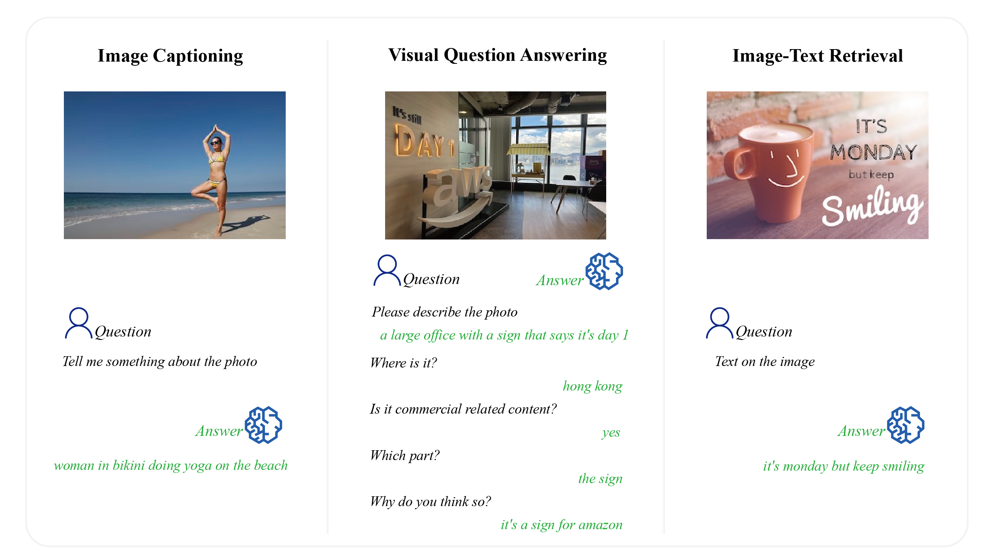

# Build a generative AI based content moderation solution on Amazon SageMaker

We use [BLIP2](https://arxiv.org/abs/2301.12597) as the multimodal pre-training method. BLIP2 is one of the SOTA models in multimodal pre-training method, and outperforms most of the existing methods in Visual Question Answering, Image Captioning and Image-Text Retrieval. For LLM, we will use [Llama 2](https://ai.meta.com/llama/), the next generation open source large language model, which outperforms the existing open source language models on many benchmarks including reasoning, coding, proficiency, and knowledge tests.

    <figcaption>Solution Architecture</figcaption>

    <figcaption>Illustration</figcaption>

## Example

We use several images to showcase BLIP2's performance in various tests, including image captioning, visual question answering, and image-text retrieval. Additionally, we evaluate BLIP2's ability to identify unsafe content in images and provide explanations using effective prompts.

    <figcaption>Use Cases</figcaption>

## Security

See [CONTRIBUTING](CONTRIBUTING.md#security-issue-notifications) for more information.

## License

This library is licensed under the MIT-0 License. See the LICENSE file.

    